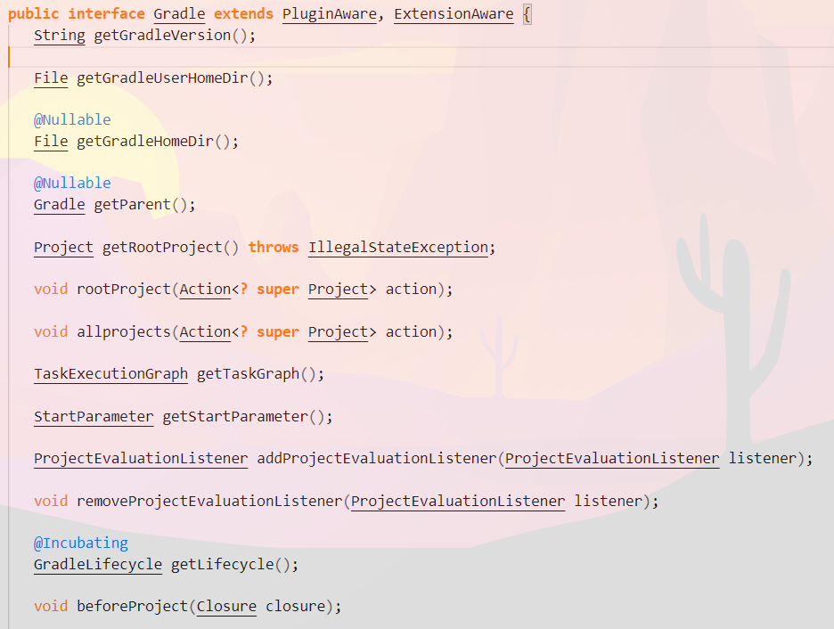
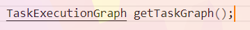
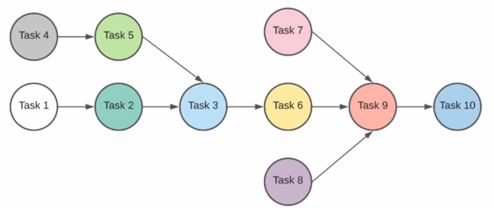
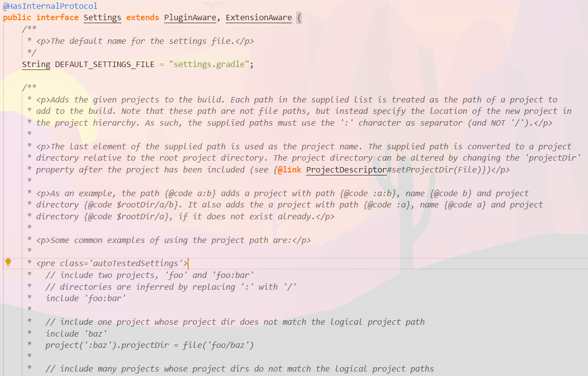
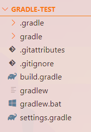
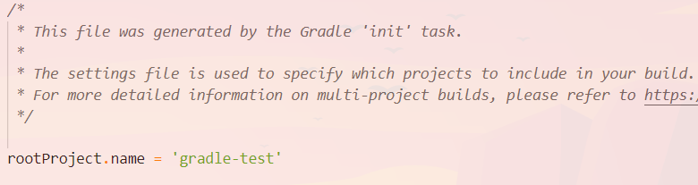
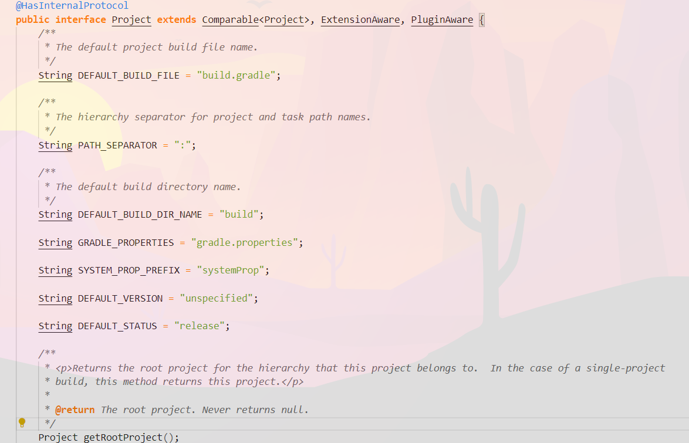
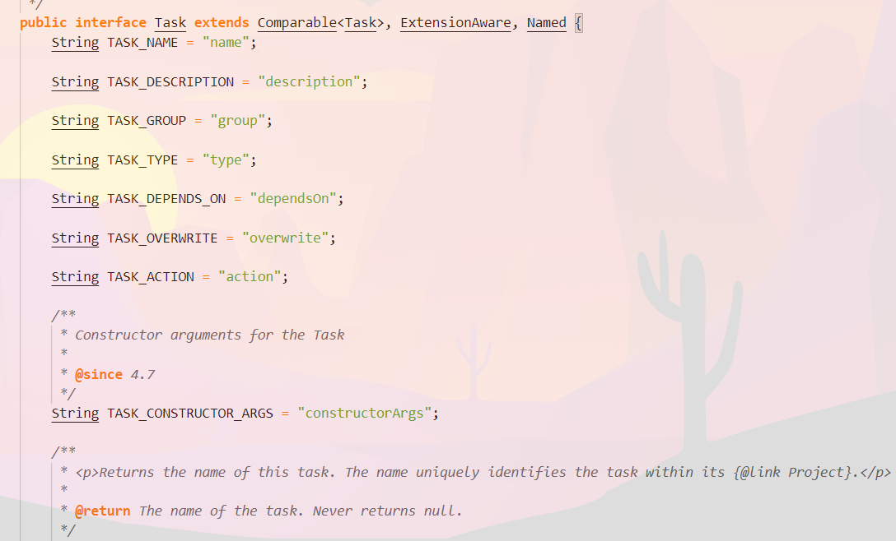
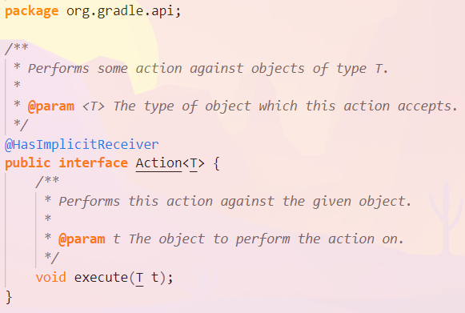

## Основные сущности Gradle

Поскольку в большинстве своём Gradle написан на Java, все основные сущности являются java-классами / интерфесами. Соответственно с ними можно проводить такие же операции, как и с классами в java.

Ниже будут представлены примеры шести основных сущностей для полного понимания работы Gradle. Вы всегда можете покопаться в исходном коде и получить небывалое удовольствие от понимания процессов работы.

### interface Gradle

Это ключевой объект, когда мы запускаем наш билд. Все последующие объекты так или иначе будут взаимодействовать с этим интерфейсом. В данном интерфесе содержится куча различных методов, но нам будет интересен `getTaskGraph()`,

т.к. для сборки проектов используется однонаправленный ациклический граф:

### abstract class Script

Этот объект является описанием файлика `settings.gradle`. Для начала заглянем в интерфес (он не слишком большой), а после в `settings.gradle`, который появляется вместе с дефолтной структурой gradle-проекта. Ниже рассмотрим и её.

структура проекта:

И сам файл `settings.gradle`:

Как видно, в этом файлике указано, что мы хотим поднимать, и наш абстрактный класс `Script` будет являться представлением этого файла.

### interface Project

Объект `project` является представлением файлика `build.gradle`. Поскольку у нас не многомодульный проект, то будет создан только один объект `project` на основе единственного файлика `build.gradle`

### interface Task

Данный интерфейс является описанием того, какие конкретно задачи мы хотим делать с нашим проектом (например, `gradle init`) В свою очередь, таски состоят из actions.

### interface Action

Данный интерфейс содержит в себе единственный метод execute(T t) для выполнения задачи.
Чтобы `task` могла работать, она должна содержать в себе хотя бы один `action`.

### interface Script

Данный интерфейс описывает все наши скрипты: `build.gradle`, `settings.gradle`. На основании каждого из
этих фалов создаётся `script` объект, который описывает соответствующую модель, будь то 
`project` или `gradle`