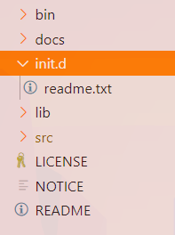

## Gradle lifecycle

Как мы помним, `gradle` является java-приложением, задача которого, по сути,
считать наши скрипты и на их основе построить объектную модель. 
Давайте рассмотрим основные фазы жизненного цикла gradle-приложения.

### Initialization phase

#### Step 1
Происходит считывание init скриптов, расположенных в корневой директории gradle

Поскольку у нас там только ридмик, то очевидно, что никаких скриптов нету. Но, когда мы добавим любой файл с расширением
`.gradle`, для него создастся объект `script` (один из шести основных интерфейсов), который является полным объектным соответствием
для каждого написанного скрипта `.gradle`. И все скрипты, что мы создадим в папке init.d, будут служить лишь для
создания одного из шести основных объектов - `gradle`.

#### Step 2

Происходит считывание файла `settings.gradle`, на основе которого создаётся объект `script`, на основе которого создаётся объект `settings`. Вообще `settings.gradle` нужен для мультимодульных проектов, т.к. в `settings.gradle` идёт описание всех модулей для сборки проекта.

### Configuration phase

#### Step 3

Теперь мы знаем, какие проекты нужно собирать. Мы описали это в `settings.gradle`.

Поскольку в `settings.gradle` прописана директория `'gradle-test'`, то файлик `build.gradle` будет загружен отсюда. На основе `build.gradle` создаётся `script`, на основе которого создаётся `project`.

### Execution phase

#### Step 4

Берём `project` и вызываем нужные `task`, которые мы описали. 

