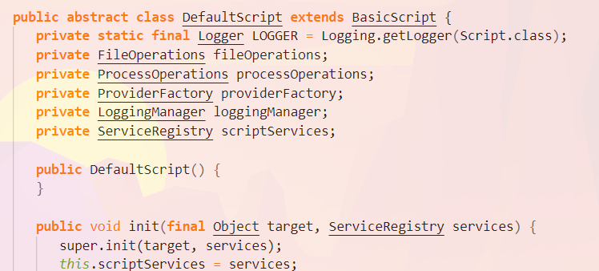

### Gradle object lifecycle

Рассмотрим фазу, когда мы считываем скрипты из директории `init.d`.
На практике очень редко можно встретить написание сриптов на этой фазе, но всё же попробуем.

Зайдём в директорию init.d

Как видно, в самом ридмике нам предлагают написать свой файлик `.gradle`. Давайте это сделаем.
Каждый файл `.gradle` под капотом является groovy скриптом, потому что groovy всё равно, какое слово вы пишите после точки.

Создадим скрипт `myscript.gradle`

Давайте занесём в скрипт какой-либо метод интерфейса `gradle`

Объясню, почему мы обращаемся к объекту `gradle`. В данный момент мы находимся в файле с разрешением `.gradle`. Соответственно этот файл будет преобразован в объект `script`, на основе которого будет построен объект `gradle`. Соответственно вы можем вызвать почти все методы интерфейса `gradle`.

Давайте залезем в кишки считывания нашего `myscript.gradle` 

Добавим в наш `myscript.gradle` метод `toString()` и посмотрим, что произойдёт.

Запускаем... (в терминале нашего проекта пишем слово `gradle`)

Итак, что мы видим. А видим мы, что при вызове метода `toString()` нам вернулась строка `initialization script`. Поскольку мы не указывали, какой объект мы хотим дёрнуть, то по дефолту дёргается интерфейс `script`, который преображается в абстрактный класс `InitScript`. Давайте в него провалимся.

А вот и наш метод `toString()` с нашей строкой `initialization script`. Удобно, когда мы работаем с java-объектами, правда?

Но это только разогрев.

Как мы видим, `InitScript` наследуется от `DefaultScript`. Провалимся и туда.

Данный класс является основой для большинства скриптов, которые нам будут нужны.

Как происходит преобразование `DefaultScript` в нужный нам, например `InitScript`?
Вся логика находится в методе `init()`.

Вызывется родительский метод `init()` класса `BasicScript`

В классе `BasicScript` у нас есть поле `target`, в которое мы будем ложить, например, наш класс `InitScript`. Разумеется, это происходит автоматически.

Соответсвенно вызывается метод `setScriptTarget()`

где мы устанавливаем в наше поле `target` объект `InitScript`

Далее в классе `BasicScript` вызывется метод  `apply()`, в который поступает объект `Closure`. `Closure` является представлением всего того, что мы написали в init-скрипте.

Соответственно класс `DefaultObjectConfigurationAction` является обёрткой для нашего `InitScript`, и мы с помощью `ConfigureUtil` говорим, как конкретно нужно настроить наш `InitScript`.

Пробежимся ещё раз по всем шагам для закрепления:

1. Создаётся объект `Gradle gradle = new DefaultGradle()`
2. Сканируется директория `init.d`
3. На основе каждого файла с расширением `.gradle` создается `Script script = new InitScript()`
4. Мы собираемся инициализировать наш `gradle` объект, поэтому у `script` вызывается метод `init(gradle)`. Тем самым мы объясняем, на кого мы будем перекладывать вызовы из файла `.gradle`
5. Чтобы объяснить скрипту, что конкретно мы хотим сделать с `gradle`, вызывается метод `script.apply(file)`. Файл преобразуется в `Closure`.
6. Внутри файла `Closure` мы можем обращаться к любым нужным нам объектам.
7. Чтобы указать, на ком мы хотим выполнять инструкции, считанные с нашего файла `.gradle`, вызывается метод `closure.delegate(gradle)`

Напомню, что вы всегда можете самостоятельно полазать по классам сборщика gradle и изучить всё более подробно.
