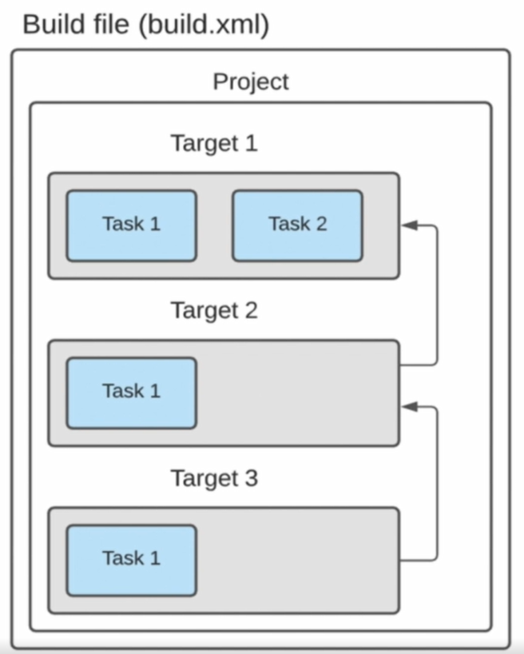
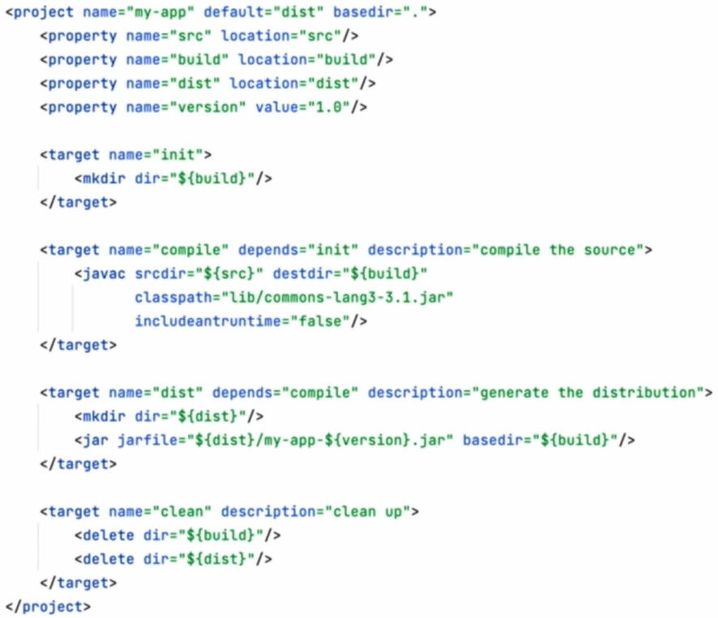
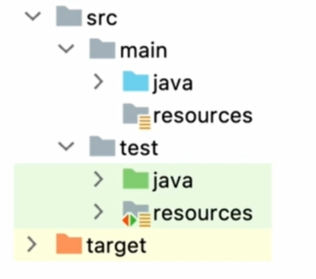
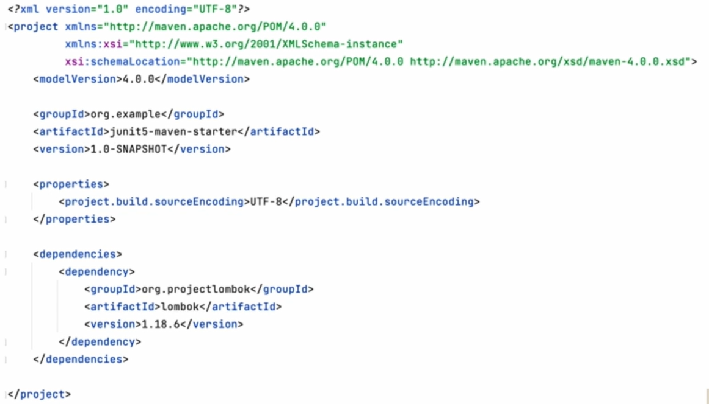
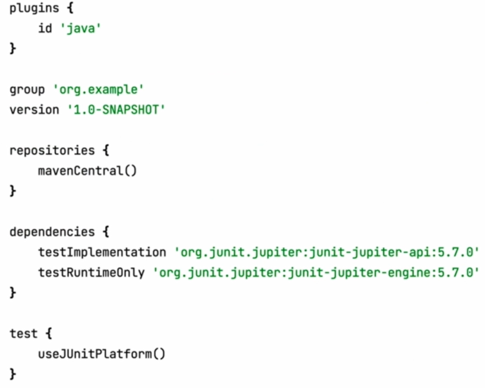

# Introduction

## История build tools

Изначально build tools представляли из себя обычные скрипты:
`shell (.sh)` для unix систем
`batch (.bat)` для windows

Со временем программы росли в размерах, что способствовало появлению первых buld tool, таких как:

`Make` (1976) - до сих пор используется (вау), но только для UNIX

`Apache Ant` (2000) - build tool, где в качестве build file используется XML.
Является кроссплатформенным аналогом `make`, потому что написан на java
и использует XML вместо платформенно зависимых команд.

Структура взаимодействия тасок:

Пример build file:

Плюсы: 
1. Гибкий
2. Легко расширяемый

Минусы:
1. Нет общих стандартов (спецификации)
2. Большой порог входа в проект
3. Очень много boilerplate кода
4. Не поддерживает dependency management

`Maven` (2002) - build tool, где в качестве build file также используется XML (POM - Project Object Model).
Maven требовал соблюдения определённой структуры проекта:

Все мы знаем, как выгдялит pom.xml:

Плюсы:
1. Общая структура для всех проектов
2. Небольшой порог входа в новый проект
3. Поддерживает dependency management

Минусы:
1. pom.xml
2. Громоздкая система плагинов
3. Сложная расширяемость и гибкость

`Gradle` (2007) - это build tool для автоматизации сборки проектов, построенный
на принципах Apache Ant и Apache Maven, но предоставляющий более удобный DSL (Domain
Specific Language) на языках Groovy (Kotlin) вместо Xml формата.

Как выглядит build:

Плюсы:
1. Общая структура для всех проектов
2. Поддерживает dependency management
3. Гибкий и легко расширяемый (tasks)
4. Удобный build file (Groovy, Kotlin, DSL)

Минусы:
1. Более высокий порог входа (Groovy, Kotlin)